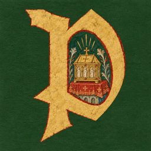

# pilgrimage

A medieval settlement builder inspired by RollerCoaster Tycoon & Age of Empires II.

## Iconography

The mark (a parchment Cinzel Black "P" on forest green) is designed in Paper: https://app.paper.design/file/01M1QTYBYHXP4H1BXFQ79N18AP/2-0/G3-0. It lives in the repo as `public/icon.svg` (vector, the source for every raster size), `public/favicon.ico`, `public/apple-icon.png`, the `public/icon-*.png` PWA sizes in `public/manifest.json`, and `app/opengraph-image.png`, which also serves as the GitHub social preview (Settings → General → Social preview).

This is a [Next.js](https://nextjs.org) project bootstrapped with [v0](https://v0.app).

## Built with v0

This repository is linked to a [v0](https://v0.app) project. You can continue developing by visiting the link below -- start new chats to make changes, and v0 will push commits directly to this repo. Every merge to `main` will automatically deploy.

[Continue working on v0 →](https://v0.app/chat/projects/prj_G39IsnKLmJqSmAYFjBQLSAj6qWzc)

## Getting Started

First, run the development server:

```bash
npm run dev
# or
yarn dev
# or
pnpm dev
```

Open [http://localhost:3000](http://localhost:3000) with your browser to see the result.

You can start editing the page by modifying `app/page.tsx`. The page auto-updates as you edit the file.

## Learn More

To learn more, take a look at the following resources:

- [Next.js Documentation](https://nextjs.org/docs) - learn about Next.js features and API.
- [Learn Next.js](https://nextjs.org/learn) - an interactive Next.js tutorial.
- [v0 Documentation](https://v0.app/docs) - learn about v0 and how to use it.

<a href="https://v0.app/chat/api/kiro/clone/tomjohndesign/pilgrimage" alt="Open in Kiro"></a>
